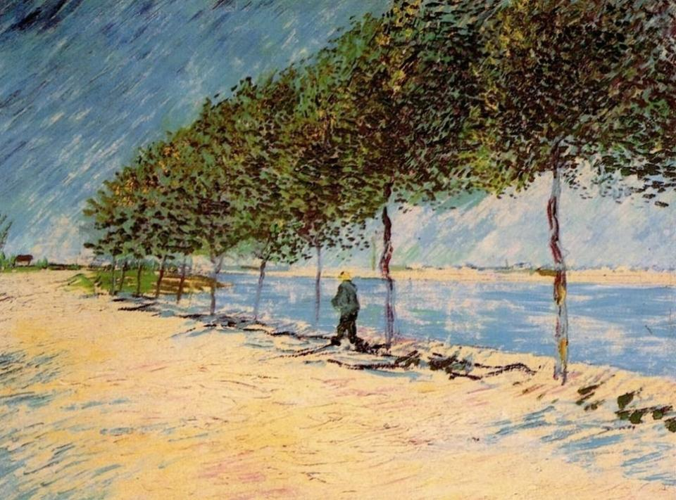

# Radiancy
### [Yellow Brick Road - Try Rust by Blockchain](https://udtrokia.github.io/Radiancy)

### [Chapter 1 - Basquiat - Orphan Blockchain](/markdown/basquiat/README.md)

+ One file version - [v0.0.5][1]
+ Stable version - [v0.0.6][2]

### [Chapter 2 - Andy - Workable Blockchain](/markdown/andy/README.md)

+ Stable version - [v0.0.10][3]

### [Chapter 3 - Bruno - Persistent Blockchain](/markdown/bruno/README.md)

+ Stable version - [v0.0.11][4]

### [Chapter 4 - Paul - Tradable Blockchain. Part 1](/markdown/paul/README.md)

+ Stable version - [v0.0.12][5]

### [Chapter 5 - Vincent - Crypto Blockchain](/markdown/vincent/README.md)

+ Stable version - [v0.0.13][6]

### [Chapter 6 - Claude - Tradable Blockchain. Part 2](/markdown/claude/README.md)

+ Stable version - [v0.0.14][7]

[1]:https://github.com/udtrokia/Radiancy/releases/tag/v0.0.5
[2]:https://github.com/udtrokia/Radiancy/releases/tag/v0.0.6
[3]:https://github.com/udtrokia/Radiancy/releases/tag/v0.0.10
[4]:https://github.com/udtrokia/Radiancy/releases/tag/v0.0.11
[5]:https://github.com/udtrokia/Radiancy/releases/tag/v0.0.12
[6]:https://github.com/udtrokia/Radiancy/releases/tag/v0.0.12
[7]:https://github.com/udtrokia/Radiancy/releases/tag/v0.0.13
